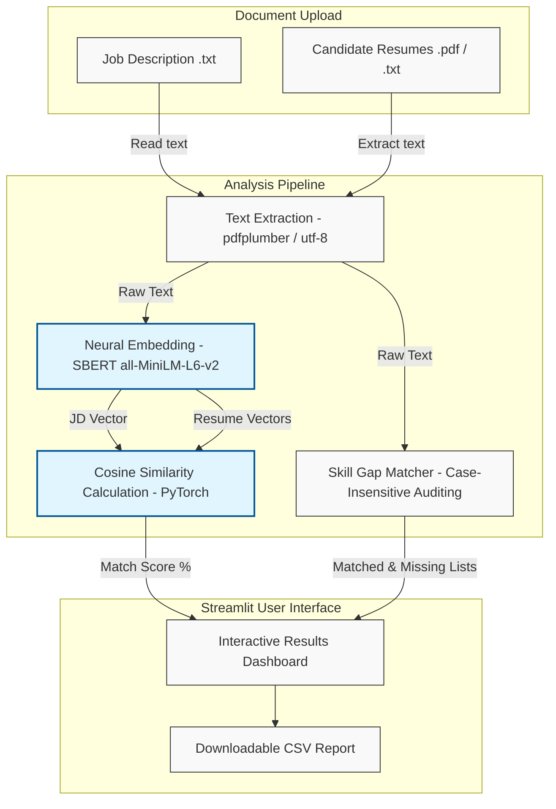

# ResumeMatch-AI

> An AI-powered resume screening tool using Sentence-BERT (SBERT) for semantic matching and skill gap insights.

[](https://www.python.org/)
[](https://streamlit.io/)
[](https://www.sbert.net/)
[](https://pytorch.org/)
[](LICENSE)

ResumeMatch-AI is an interactive web application that automates the initial phases of candidate screening. Using deep-learning semantic representation, the system parses candidate resumes (PDF or TXT) and matches them against job descriptions to score and rank candidates based on contextual relevance.

Unlike traditional keyword-filtering tools, ResumeMatch-AI utilizes pre-trained Sentence Transformers to capture the semantic context of descriptions and experience, mapping candidate skills and highlighting missing prerequisites.

---

## System Architecture

The application handles text extraction, neural sentence embedding, matching, and analysis through a streamlined processing pipeline:



---

## Features

*   **Semantic Matching Engine**: Uses pre-trained Sentence-BERT (`all-MiniLM-L6-v2`) to compute high-dimensional embedding vectors for job descriptions and resumes, ranking them by cosine similarity.
*   **Skill Gap Analysis**: Compares parsed candidate resumes against a core directory of technical skills to identify missing credentials.
*   **Multi-Format Parsing**: Extracts text from PDF documents using `pdfplumber` and handles encoding issues for flat `.txt` files.
*   **Real-time Dashboard**: Displays ranking lists with responsive visual progress bars, listing matched and missing skills.
*   **CSV Report Generation**: Formulates structured candidate matching summaries available for instant HR download.

---

## System Screens

### 1. File Upload Portal


### 2. Candidate Matching Reports


---

## Tech Stack

*   **Language**: Python 3.8+
*   **Web Interface**: Streamlit
*   **NLP Model**: Sentence-BERT (SBERT) via the `sentence-transformers` library
*   **Linear Algebra & Computations**: PyTorch (used internally for cosine similarity calculations) and `scikit-learn`
*   **Text Parsers**: `pdfplumber` for PDF processing
*   **Data Processing**: `pandas`

---

## Folder Structure

```
ResumeMatch-AI/
├── app/                         # Application Source Files
│   ├── __init__.py
│   ├── main.py                  # Streamlit Interface & State Controller
│   ├── matcher.py               # SBERT Encoding & Similarity Engine
│   └── utils.py                 # File I/O, PDF Parsing & Skill Verification
├── models/                      # Weights & Vectorizer Cache Directory
├── sample_data/                 # Flat files used for system testing
├── uploaded_jd/                 # Local directory for temporary job description uploads
├── uploaded_resumes/            # Local directory for temporary candidate resume uploads
├── requirements.txt             # Python Package Dependencies
├── generate.py                  # Utility script to generate sample test files
└── README.md                    # Core Documentation
```

---

## Local Setup

### Prerequisites
*   Python 3.8 or higher installed on your system.
*   A package manager like `pip`.

### Setup Instructions
1. Clone the repository:
   ```bash
   git clone https://github.com/joel8779/University_App.git
   cd AI_Resume_Screener
   ```
2. Set up a virtual environment:
   ```bash
   python -m venv venv
   ```
3. Activate the virtual environment:
   *   **Windows (PowerShell)**:
       ```powershell
       .\venv\Scripts\Activate.ps1
       ```
   *   **Windows (Command Prompt)**:
       ```cmd
       venv\Scripts\activate.bat
       ```
   *   **Linux/macOS**:
       ```bash
       source venv/bin/activate
       ```
4. Install the required dependencies:
   ```bash
   pip install -r requirements.txt
   ```
5. Run the Streamlit web application:
   ```bash
   python -m streamlit run app/main.py
   ```

---

## API & Function Documentation

The codebase is split into modular components designed for reuse:

### `app.matcher.match_resumes(job_description, resumes)`
Computes semantic similarity scores.
*   **Parameters**:
    *   `job_description` (*str*): The text of the target job description.
    *   `resumes` (*list*): A list of dictionaries containing keys `"filename"`, `"text"`, and `"skills"`.
*   **Returns**: A sorted list of candidate dictionaries containing:
    *   `"filename"` (*str*): The resume file name.
    *   `"score"` (*float*): Cosine similarity score rounded to two decimal places (0–100%).
    *   `"skills"` (*list*): The list of matched skills.

### `app.utils.extract_text_from_pdf_or_txt(file_path)`
Parses unstructured documents.
*   **Parameters**:
    *   `file_path` (*str*): Path to target document on local disk.
    *   `Returns` (*str*): Extracted text. Falls back to empty string for unsupported formats.

### `app.utils.extract_skills(text, skill_keywords)`
Audits text for predefined technical keywords.
*   **Parameters**:
    *   `text` (*str*): Source text extracted from resume.
    *   `skill_keywords` (*list*): Target skills directory.
*   **Returns**: List of matching strings found in the text.

---

## Engineering Decisions & Insights

### 1. Semantic Search vs. Keyword Matching
Keyword matching (like standard TF-IDF or regex checks) fails when candidates describe their experience using synonyms (e.g., writing "Deep Learning" instead of "Machine Learning"). 
*   **Decision**: Sentence-BERT (using the `all-MiniLM-L6-v2` transformer model) encodes the entire document text into a 384-dimensional dense vector space. 
*   **Benefit**: Cosine similarity is computed between the job description vector and candidate resume vectors, capturing context and synonyms rather than exact spelling matches.

### 2. Robust Document Parsing
Resume files are frequently uploaded as unstructured PDFs. Using basic text-extraction libraries can lead to corrupted character encoding or text column alignment issues.
*   **Decision**: Integrated `pdfplumber` instead of standard older libraries like `PyPDF2`.
*   **Benefit**: `pdfplumber` excels at extracting text from multi-column layout PDFs, preserving logical word positioning to maintain high semantic encoding accuracy.

### 3. Filesystem Sandboxing & Collisions
To prevent filename collisions when multiple candidates upload files with generic names (e.g., `Resume.pdf`), the system sandboxes documents:
*   Files are renamed on upload with a prepended `uuid.uuid4()` identifier.
*   The "Clear Uploaded Files" button handles safe recursive deletion of temp storage folders using `shutil.rmtree`.

---

## Future Roadmap

1.  **Vector Database Integration**: Replace on-the-fly model encoding with a vector database (like ChromaDB or FAISS) to cache candidate resume vectors, preventing redundant model execution.
2.  **Entity Recognition (NER)**: Implement Spacy or custom transformers to extract candidate contact details, work history length, and education dynamically.
3.  **Fine-tuned Models**: Fine-tune the pre-trained SBERT model on tech-domain corpus data (like software engineering job posting descriptions) to improve industry-specific scoring.
4.  **Asynchronous Processing**: Refactor Streamlit file execution to run matching tasks asynchronously via Celery or Redis queues to support larger document batch sizes.

---

## Contributing

Contributions are welcome. Please open an issue first to discuss the changes you want to make.

1. Fork the Repository.
2. Create a feature branch (`git checkout -b feature/improvement`).
3. Commit your changes (`git commit -m 'feat: description'`).
4. Push to your branch (`git push origin feature/improvement`).
5. Open a Pull Request.

---

## License

This project is licensed under the MIT License. See the [LICENSE](LICENSE) file for details.
